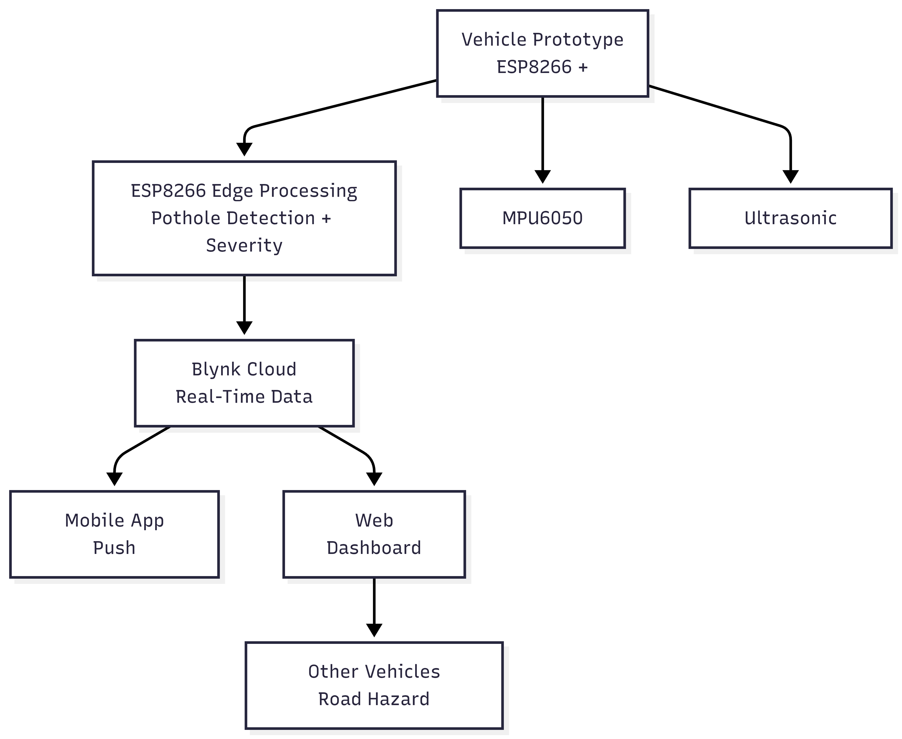
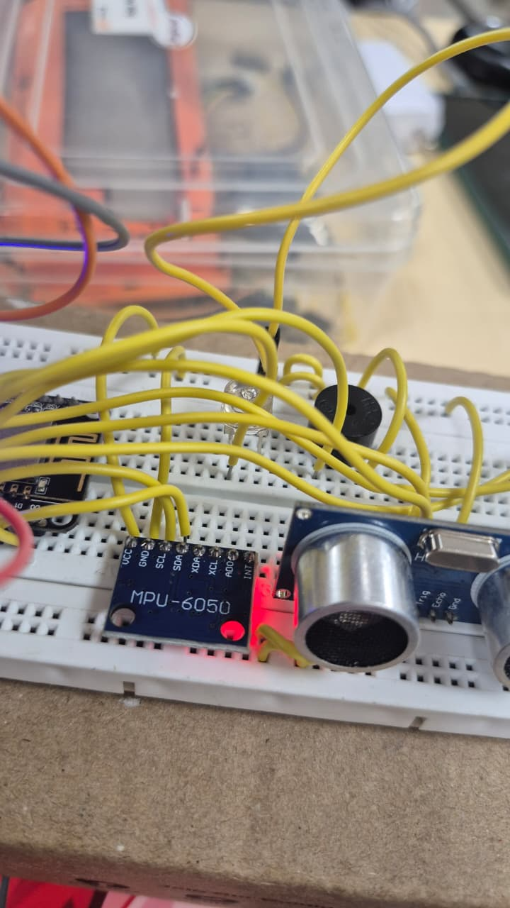
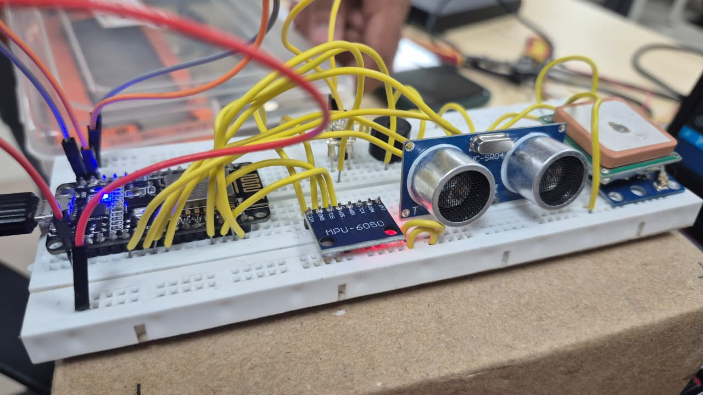
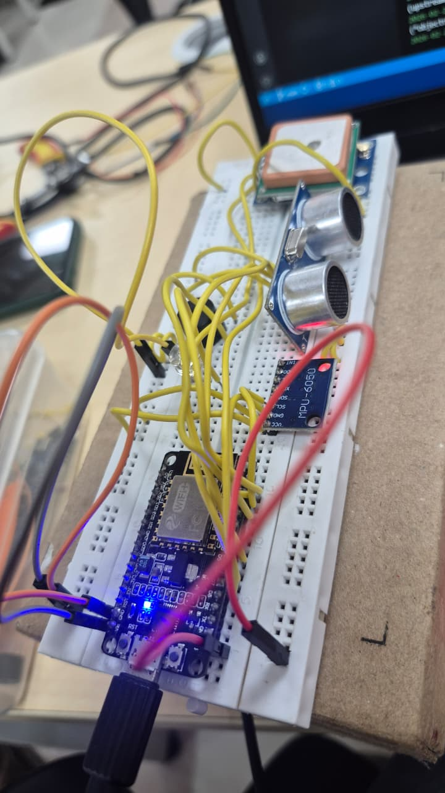

<p align="center">
  
</p>

# Smart Pothole Intelligence System 🎯

## Basic Details

### Team Name: SENMONI

### Team Members
- Member 1: Devika C - Mar Athanasius College of Engineering, Kothamangalam
- Member 2: Fathima Nidha T H - Mar Athanasius College of Engineering, Kothamangalam

### Hosted Project Link
[\[mention your project hosted link here\]](https://drive.google.com/drive/folders/1B55uJYQBMvaOKfBuFo2C3PqY7WouySxw)

### Project Description
Smart Pothole & Road Damage Intelligence System is a vehicle-mounted IoT solution that detects potholes using sensors and instantly sends alerts to nearby vehicles through a live web dashboard. The system classifies road damage severity and visualizes it on a real-time map to improve road safety.

### The Problem statement
Road potholes and sudden road damage cause accidents, vehicle damage, and fuel wastage. Authorities lack real-time road condition data, and drivers receive no prior warning about dangerous road sections.

### The Solution
Our system uses an ESP8266 with an MPU6050 IMU and ultrasonic sensor to detect potholes based on shock intensity and road depth. Detected potholes are classified into risk levels and sent via WiFi to a live web dashboard where markers appear on a map, warning other vehicles in real time.

---

## Technical Details

### Technologies/Components Used

**For Software:**
- Languages used: C++, HTML, JavaScript
- Frameworks used: None (Lightweight Web App)
- Libraries used: Blynk IoT, Leaflet.js (Map)
- Tools used: Arduino IDE, VS Code, GitHub

**For Hardware:**
- Main components: ESP8266 NodeMCU, MPU6050 IMU Sensor, HC-SR04 Ultrasonic Sensor, LED, Active Buzzer, Breadboard, Jumper wires, USB power
- Specifications: ESP8266 WiFi enabled microcontroller, MPU6050 6-axis accelerometer + gyroscope, Ultrasonic range detection (2–400 cm)
- Tools required: Arduino IDE, USB cable, Laptop

---

## Features

List the key features of your project:
- Feature 1: Real-time pothole detection using IMU + ultrasonic fusion
- Feature 2: Risk classification (Low / Medium / High)
- Feature 3: Live map visualization with colored markers
- Feature 4: Push notifications via Blynk app
- Feature 5: Smart vehicle-to-vehicle alert concept

---

## Implementation

### For Software:

#### Installation
```bash
Install Arduino IDE
Install ESP8266 board package
Install libraries:
- MPU6050
- TinyGPS++
- Blynk
```

#### Run
```bash
Upload Arduino code
Open Serial Monitor (115200 baud)
Run index.html in browser
```

### For Hardware:

#### Components Required
ESP8266 NodeMCU ×1, MPU6050 ×1, HC-SR04 ×1, LED ×1, Active Buzzer ×1, Breadboard ×1, Jumper wires

#### Circuit Setup
MPU6050 → I2C (D1=SCL, D2=SDA), Ultrasonic Trig → D5, Ultrasonic Echo → D6, LED → D0, Buzzer → D3

---

## Project Documentation

### For Software:

#### Screenshots (Add at least 3)


Live map showing pothole marker.


Blynk notification alert on phone.


Serial monitor showing detection + Low severity.


Serial monitor showing detection + High severity.

#### Diagrams

**System Architecture:**


The Smart Pothole & Road Damage Intelligence System follows a distributed IoT architecture consisting of hardware sensing, edge processing, cloud communication, and real-time visualization.

**Application Workflow:**


---

### For Hardware:

#### Schematic & Circuit


#### Build Photos








---


### For Hardware Projects:

#### Bill of Materials (BOM)

| Component | Quantity | Specifications | Price | Link/Source |
|-----------|----------|----------------|-------|-------------|
| ESP8266 NodeMCU | 1 | WiFi MCU | ₹300 | [Link] |
| MPU6050 | 1 | IMU Sensor | ₹120 | [Link] |
| HC-SR04 | 1 | Ultrasonic | ₹90 | [Link] |
| Breadboard | 1 | 830 points | ₹100 | [Link] |
| Jumper Wires | 20 | Male-to-Male | ₹50 | [Link] |
| Buzzer | 1| Active | ₹20|[Link] |

**Total Estimated Cost:** ₹680


## Project Demo

### Video
https://drive.google.com/drive/folders/1B55uJYQBMvaOKfBuFo2C3PqY7WouySxw

- pothole detection
- risk classification
- real-time map update
- push notification system


---

## AI Tools Used (Optional - For Transparency Bonus)

If you used AI tools during development, document them here for transparency:

**Tool Used:** ChatGPT

**Purpose:** 
- Debugging ESP8266 code
- Logic optimization
- UI design guidance components"


**Human Contributions:**
- Hardware assembly
- System design
- Sensor calibration
- Testing & validation

*Note: Proper documentation of AI usage demonstrates transparency and earns bonus points in evaluation!*

---

## Team Contributions

Devika C:
Hardware integration, system logic, testing, documentation.

Fathima Nidha TH:
Website development, map visualization, UI design.

---

## License

This project is licensed under the MIT LICENSE License - see the [LICENSE](LICENSE) file for details.

**Common License Options:**
- MIT License (Permissive, widely used)
- Apache 2.0 (Permissive with patent grant)
- GPL v3 (Copyleft, requires derivative works to be open source)

---

Made with ❤️ at TinkerHub
